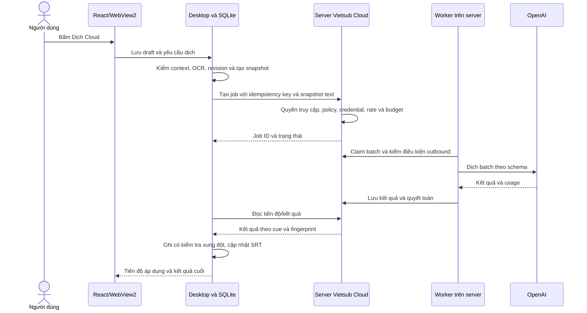

# Kế hoạch triển khai Dịch Cloud bằng OpenAI cho Vietsub

> Ngày lập: 2026-09-09. Trạng thái: **ĐÃ TRIỂN KHAI SOURCE — CHỜ NGHIỆM THU MÔI TRƯỜNG THẬT**.
> Cơ sở: source hiện hành trên dirty worktree, HEAD `2b4171c`. Thay đổi UI/media/voice đang có phải được giữ nguyên.
> Các quyết định đã triển khai và giới hạn nghiệm thu được ghi ở mục 8; không đồng nhất source/test fixture với rollout hoặc chất lượng OpenAI thật.

## 1. Yêu cầu đã thống nhất

1. Người dùng mở **Dịch tiếng Việt**, thấy popup chọn **Dịch Local / Dịch Cloud** như hiện tại.
2. Bấm **Dịch Cloud** một lần là bắt đầu xử lý. Không có popup chọn model, provider, API key, prompt hoặc tham số AI.
3. Giai đoạn đầu dùng OpenAI. Model cụ thể, credential và giới hạn chạy do server quản lý; người dùng cuối không cần biết chúng.
4. Hiển thị tiến độ, kết quả, lỗi và thao tác dừng/thử lại phù hợp. Luồng thành công thông thường không thêm bước xác nhận chi phí hoặc cấu hình kỹ thuật.
5. Dịch nội dung phụ đề OCR sang tiếng Việt, giữ cue ID, thứ tự, người nói và mốc thời gian; kết quả dùng tiếp trong editor, SRT, tạo giọng và xuất video.
6. Dịch Local tiếp tục có luồng riêng. Cloud không phụ thuộc Qwen, RAM trống, profile worker hay việc cài model local.
7. Người dùng đã yêu cầu triển khai task sau phiên lập kế hoạch. Đã sửa source/migration trong repository; chưa thực thi SQL Server, gọi OpenAI thật hoặc bật rollout.

## 2. Hiện trạng khảo sát trước khi triển khai (lưu làm căn cứ)

| Vị trí | Hiện trạng | Hệ quả cho kế hoạch |
|---|---|---|
| [VietsubSettingsPanel.tsx](TOOL-LOCAL/Web/src/features/vietsub/VietsubSettingsPanel.tsx) | Popup phương thức nằm trong file này; Cloud có `aria-disabled="true"` và nút bị khóa. Badge ngoài card đang phụ thuộc runtime Local. | Cần nối callback Cloud, readiness riêng và sửa badge cấp tác vụ, không chỉ bỏ `disabled`. |
| [useVietsubModule.ts](TOOL-LOCAL/Web/src/features/vietsub/useVietsubModule.ts) | `startTranslation` gửi `vietsub.job.translate`, có nhánh cảnh báo tài nguyên Local; xử lý tiến độ/thông báo còn so sánh `TRANSLATE_LOCAL`. | Cloud cần đường bắt đầu độc lập; phải cập nhật cả progress, notice, retry và điều kiện tài nguyên. |
| [VietsubWebBridge.cs](TOOL-LOCAL/Vietsub/VietsubWebBridge.cs) | Có handler dịch Local, context project và sự kiện job. | Host cần đọc snapshot phụ đề thật từ workspace và điều phối Cloud qua server. |
| [VietsubTranslationService.cs](TOOL-LOCAL/Vietsub/Translation/VietsubTranslationService.cs) | Bắt buộc active OCR track `PADDLE_OCR_LOCAL`, ngôn ngữ `en/zh`, có cue và revision khớp; sau đó resolve provider Local. | Tái sử dụng quy tắc nguồn, tách khỏi bước probe/resolve Local. |
| [VietsubJobModels.cs](TOOL-LOCAL/Vietsub/Jobs/VietsubJobModels.cs), [Program.cs](TOOL-LOCAL/Program.cs) | Đã có constant `TRANSLATE_CLOUD`; composition hiện đăng ký executor OCR, dịch Local và giọng Local. | Không cần tạo lại tên loại job; cần executor/adapter Cloud thực sự và đăng ký vào composition. |
| [VietsubTranslationJobExecutor.cs](TOOL-LOCAL/Vietsub/Translation/VietsubTranslationJobExecutor.cs) | Có chia cảnh, fingerprint, checkpoint, bảo vệ cue sửa tay và ghi SRT. Logic tiếp tục còn nhận diện `LOCAL_AUTO`. | Chỉ tách helper thuần cần dùng chung; không đưa Cloud vào worker Qwen. Kiểm tương thích provenance và tiếp tục dịch. |
| [VietsubTranslationStore.cs](TOOL-LOCAL/Vietsub/Translation/VietsubTranslationStore.cs) | `TryCommitCueResultAsync` ghi cứng `translation_source = 'LOCAL_AUTO'`, kiểm cue snapshot và tăng revision khi ghi. | Phải hỗ trợ nguồn Cloud, chống ghi lặp và phân biệt revision tăng do job với thay đổi từ người dùng. |
| [VietsubProjectsController.cs](TOOL-SERVER/Controllers/VietsubProjectsController.cs), [VietsubProjectService.cs](TOOL-SERVER/Vietsub/VietsubProjectService.cs) | Server hiện quản lý registry, ownership và archive, chưa có API dịch. | Thêm controller/service dịch riêng, bám đúng `vs.Projects`. |
| [GenerationAccessService.cs](TOOL-SERVER/Organizations/GenerationAccessService.cs) | Truyền `projectId` vào service này sẽ tìm project video trong `VideoFactoryDbContext`. | Không truyền VietsubProjectId vào nhánh xác thực project video. Phải ghép kiểm quyền AI theo tổ chức với ownership Vietsub. |
| [OrganizationAiGateway migration](database/VideoFactory.4.0.0.OrganizationAiGateway.sql) | `ai.BudgetReservations.ProjectId` và `ai.UsageLedger.ProjectId` có FK đến `vf.Projects`. | Không thể dùng trực tiếp VietsubProjectId để reserve/settle. Cần migration và hỗ trợ loại project tương ứng. |
| [BudgetReconciliationWorker.cs](TOOL-SERVER/Organizations/BudgetReconciliationWorker.cs) | Worker tìm `videoDb.ProviderRequests`; request không tồn tại có thể dẫn tới release. | Phải nhận diện request Cloud Vietsub, tránh hoàn tiền sai khi job đang chạy hoặc chưa rõ kết quả upstream. |
| [ProviderCredentialRetirementWorker.cs](TOOL-SERVER/Organizations/ProviderCredentialRetirementWorker.cs) | Chỉ tìm request đang chạy trong `videoDb.ProviderRequests`. | Cần tính cả job/batch Cloud đang giữ credential snapshot trước khi revoke. |
| [OpenAiContentClient.cs](TOOL-SERVER/Generation/OpenAiContentClient.cs), [ProviderRuntimeResolver.cs](TOOL-SERVER/Generation/ProviderRuntimeResolver.cs) | Đã có OpenAI Responses API, schema output, `store=false`, credential version và exact host resolver. Prompt/result hiện chuyên tạo nội dung video. | Tái sử dụng hạ tầng HTTP/credential; tạo adapter dịch phụ đề riêng. |
| [AiCostEstimator.cs](TOOL-SERVER/Generation/AiCostEstimator.cs) | Quote nội dung OpenAI dựa topic và thời lượng video; đã có tính actual từ rate snapshot/token. | Thêm cách ước tính cho input/output phụ đề, không giả thời lượng video để dùng quote cũ. |

Các ràng buộc nghiệp vụ, kiến trúc, kiểm thử và vận hành được đối chiếu với `NGHIEP_VU_HE_THONG_VIDEOMAKER.md`, `KIEN_TRUC_KY_THUAT.md`, `BOI_CANH_HE_THONG_HIEN_HANH.md`, `KIEM_THU_VA_NGHIEM_THU.md`, `VAN_HANH_VA_PHAT_HANH.md` và các `AGENTS.md` liên quan.

## 3. Phạm vi và quyết định thiết kế đề xuất

### 3.1 Trải nghiệm người dùng

Luồng chuẩn: **Dịch tiếng Việt → Dịch Cloud → Chuẩn bị → Đang dịch n/N câu → Đang lưu → Hoàn tất**.

- Dùng chính nút ở card Cloud để bắt đầu. Không tạo thao tác chọn card rồi bấm nút xác nhận khác.
- Nút nhận click phải chuyển busy ngay; xử lý double-click và phím Enter lặp.
- Trước snapshot, tự lưu bản nháp editor. Nếu lưu thất bại, hiển thị lỗi và chưa gửi Cloud.
- Nếu thiếu OCR, báo “Bạn cần quét OCR nhận dạng phụ đề trước khi dịch.”
- Nếu Cloud chưa được cấu hình, báo ngắn gọn “Dịch Cloud chưa sẵn sàng. Vui lòng liên hệ quản trị viên.” Chi tiết model/key/rate chỉ có trong vận hành server.
- Mô tả card có thể dùng “Dịch phụ đề trực tuyến. Nội dung phụ đề được gửi đến dịch vụ dịch.” Không thêm checkbox hay popup kỹ thuật.
- Hoàn tất ở server chưa đồng nghĩa đã lưu local. Chỉ báo hoàn tất đầy đủ sau khi áp dụng kết quả hợp lệ và cập nhật artifact.

### 3.2 Quy tắc chọn câu cho lần dịch đầu tiên

Đề xuất mặc định cho CTA Cloud là **tiếp tục phần cần dịch**:

- Xử lý toàn active track từ SQLite, không giới hạn ở 50 câu của trang UI hoặc các câu đang được lọc.
- Target là câu chưa có bản dịch, bản dịch đã lỗi/không hợp lệ, hoặc nguồn đã thay đổi khiến bản dịch tự động bị stale.
- Giữ cue bị khóa và bản dịch sửa tay. Bản dịch tự động còn hợp lệ không bị làm lại chỉ vì đổi từ Local sang Cloud hoặc admin đổi model.
- Cue rỗng được thống kê là bỏ qua; nếu không còn target thì báo “Phụ đề đã được dịch”, không reserve hoặc gọi OpenAI.
- Giới hạn ngôn ngữ đợt đầu theo nguồn hiện hành: `en/zh → vi` trên active OCR track. SRT nhập và ngôn ngữ khác là mở rộng riêng.
- Không tự chạy vòng review/repair có phí khi kết quả không đạt. Giữ kết quả hợp lệ, đánh dấu lỗi/cần xem lại và cho thử lại phần thất bại khi phù hợp.

Đây là mặc định kỹ thuật đề xuất để tránh ghi đè và dịch lại ngoài ý muốn; yêu cầu “dịch lại toàn bộ bằng Cloud” chưa nằm trong phạm vi người dùng đã chốt.

### 3.3 Phân chia trách nhiệm



- Server sở hữu job Cloud, batch, provider attempt, model/prompt/rate/credential snapshot và sổ chi phí.
- Desktop sở hữu project workspace, cue gốc, trạng thái sửa tay, revision và việc áp dụng kết quả. Job `TRANSLATE_CLOUD` local theo dõi/synchronise server job; không có API key hoặc OpenAI SDK trong desktop.
- `TOOL-VIETSUB-TRANSLATION-WORKER` chỉ tiếp tục xử lý Qwen local. Server không tham chiếu assembly WinForms hoặc worker Qwen để chạy Cloud.
- Đóng desktop không xóa server job hoặc tự gửi lại request. Batch đã được nhận xử lý có thể hoàn tất; trước batch tiếp theo vẫn phải thỏa quyền/session/device/license lease. Nếu lease hết hạn thì chờ khôi phục quyền, không hứa chạy vô hạn sau khi đóng desktop.
- Mặc định chỉ một batch đang gọi provider trên mỗi job. Có giới hạn concurrency theo tổ chức và toàn server.

### 3.4 Dữ liệu gửi và lưu trên server

Cloud bổ sung một đường truyền text được người dùng chủ động chọn. Cần cập nhật mô tả “server không nhận subtitle” trong tài liệu thành ngoại lệ cụ thể cho tác vụ này khi triển khai.

- `vs.Projects` vẫn chỉ giữ registry; không biến thành kho nội dung editor.
- Job Cloud nhận cue text cần dịch, ngữ cảnh lân cận cần thiết, mã cue, timing cần cho độ dài câu, speaker, glossary/context đã cấu hình và fingerprint.
- Không upload video, audio, frame, SRT nguyên tệp, absolute path hoặc toàn bộ translation memory không liên quan. Không gửi tên file/project nếu không cần cho dịch.
- Payload/result tạm của job lưu tách khỏi audit/ledger, được mã hóa bằng cơ chế server sở hữu và giới hạn quyền đọc.
- Đề xuất retention khởi điểm: dọn input trong 24 giờ sau terminal; result có tối đa 7 ngày để desktop lấy lại, có ACK sau khi lưu bền vững để dọn sớm theo policy. Job treo/Unknown có giới hạn giữ payload riêng; metadata đối soát không bị xóa cùng payload.
- Trả `resultExpiresAtUtc`; hết hạn phải báo rõ, không tự dịch lại có phí. Cache/dedup giới hạn trong đúng tổ chức, chủ sở hữu và project.
- Hash chứng minh snapshot nhất quán, không chứng minh server đã kiểm tra filesystem hoặc OCR thực tế. Host kiểm active track/revision từ local; server coi text là dữ liệu không tin cậy, vẫn tự kiểm quyền, kích thước và chi phí.

### 3.5 Model và cấu hình

- Cấu hình server theo operation `VietsubSubtitleTranslation`, provider OpenAI và một model được pin cho mỗi job.
- Không nhận model/provider/base URL/credential từ DOM hoặc DTO bắt đầu job.
- Chưa chốt model cụ thể trong kế hoạch. Task cấu hình sẽ chọn từ catalog đủ khả năng structured output, kiểm chất lượng Anh/Trung, latency và chi phí, rồi đặt làm cấu hình vận hành.
- Không đổi model/prompt/credential/rate giữa job khi admin thay cấu hình. Retry thuộc job cũ dùng snapshot cũ hoặc dừng với lỗi rõ; không fallback sang model khác.
- `VietsubCloudTranslationEnabled` đề xuất mặc định `false` trước nghiệm thu. Khả dụng thực tế do server trả về, độc lập `VietsubLocalTranslationEnabled`.

## 4. Danh sách task và phụ thuộc

Checkbox T01–T11 theo dõi đầu ra source; T12–T13 theo dõi kiểm thử/build đã thực hiện. Rehearsal SQL Server, concurrency trên nhiều instance thật, chất lượng OpenAI và rollout được giữ riêng ở T14. Đọc các điều chỉnh cụ thể tại mục 8 trước khi nghiệm thu môi trường.

| ID | Task | Phụ thuộc | Kết quả bàn giao |
|---|---|---|---|
| T01 | Chốt luồng và bộ tình huống nghiệm thu | Không | Đặc tả trạng thái, target, dữ liệu và retry |
| T02 | Contract server/desktop/WebView | T01 | DTO, endpoint và mã lỗi thống nhất |
| T03 | Cấu hình model, readiness và feature flag | T02 | Cloud khả dụng đúng điều kiện, không lộ model |
| T04 | Schema job Cloud và liên kết chi phí Vietsub | T02 | Migration idempotent, EF và tương thích dữ liệu cũ |
| T05 | API, authorization và snapshot đầu vào | T02–T04 | Job chỉ được nhận sau đúng gate |
| T06 | Chia batch, context và adapter OpenAI | T02–T03 | Kết quả có schema và kiểm đầy đủ cue |
| T07 | Quote, reserve, settle và worker đối soát | T04–T06 | Sổ chi phí đúng cả lỗi/timeout/restart |
| T08 | Worker Cloud, checkpoint và điều khiển job | T05–T07 | Job bền vững, không gửi trùng khi phục hồi |
| T09 | Desktop client và điều phối `TRANSLATE_CLOUD` | T02, T05, T08 | Bấm Cloud chạy qua server, nối lại được |
| T10 | Áp dụng kết quả và tương thích subtitle/voice | T09 | Bản dịch ghi an toàn, không mất sửa tay |
| T11 | UI Cloud một lần bấm | T03, T09–T10 | Luồng đúng ảnh hiện tại, tiến độ/lỗi rõ |
| T12 | Kiểm thử liên module và hồi quy | T01–T11 | Ma trận test với bằng chứng từng nhóm |
| T13 | Build, nghiệm thu và tài liệu | T12 | Bundle đồng bộ và báo cáo kiểm thử |
| T14 | Chuẩn bị môi trường và rollout có kiểm soát | T13 | Cloud được bật trên môi trường đã nghiệm thu |

### T01 — Chốt luồng và bộ tình huống nghiệm thu

**Mục tiêu:** các lớp hiểu giống nhau về một lần bấm Dịch Cloud.

- [x] Ghi luồng chuẩn ở mục 3.1 thành acceptance scenario.
- [x] Chốt quy tắc target ở mục 3.2; tách nội dung nguồn fingerprint khỏi fingerprint engine/prompt để đổi model không tự khiến mọi câu thành cần dịch lại.
- [x] Chốt một job Cloud hoạt động trên mỗi project, kể cả khi có hai desktop đăng nhập cùng tài khoản.
- [x] Chốt ma trận hành động khi đang chạy: phát/tua và đọc được phép; sửa cue vẫn được bảo vệ bằng CAS; chặn job OCR/dịch/giọng mới gây xung đột; thao tác cấu trúc/đổi track phải bị chặn hoặc làm kết quả cũ không áp dụng.
- [x] Chốt dừng, tạm dừng, tiếp tục, mất mạng, hết lease, ngân sách không đủ giữa job và kết quả hết hạn.
- [x] Chuẩn bị cue fixture Anh/Trung: hội thoại nhiều speaker, tên riêng, câu dài, câu OCR rỗng, cue khóa/sửa tay và nguồn đổi giữa chừng.

**Nghiệm thu:** từng tình huống có kết quả UI, local state, server state và quy tắc có/không được outbound. Không có bước chọn model hoặc cấu hình key trong luồng người dùng.

### T02 — Contract server/desktop/WebView

**File dự kiến:** thêm `TOOL-SHARED.Contracts/Vietsub/VietsubCloudTranslationContracts.cs`; cập nhật DTO native thực tế trong `VietsubWebBridge.cs`, TypeScript `features/vietsub/types.ts` và message chung nơi cần.

- [x] Định nghĩa request start: organization/project từ context; client operation ID, expected track ID/revision, phiên bản snapshot, snapshot hash, source/target language, target cue và context có giới hạn.
- [x] Cue snapshot có ID/index/timing/speaker/text/target/fingerprint. C# đọc từ workspace; trạng thái khóa/nguồn/updatedAt được giữ và kiểm ở desktop trước chọn target/apply, không đưa trạng thái biên tập dư thừa vào provider input.
- [x] Response start/status chỉ có job ID, stage/status, số câu tổng/đã xử lý/lỗi/bỏ qua, retryability, safe error và thời hạn result; không trả key/model/config nhạy cảm.
- [x] Result trả mapping cue/fingerprint/text/warnings, snapshot hash và cursor theo batch. Desktop kiểm snapshot/operation, tải lại trang an toàn nhờ receipt atomic. Provenance dùng `CLOUD`/`subtitle-v1`; không đưa model name vào UI.
- [x] GET readiness/status/result phải thuần đọc đối với generation: không tự reserve, submit hoặc gọi provider.
- [x] Thêm endpoint tìm job theo client operation ID để xử lý POST thành công nhưng response bị mất.
- [x] Định nghĩa compatibility: client cũ không biết field Cloud vẫn chạy Local; Cloud không sẵn sàng trên server cũ phải hiện trạng thái phù hợp, không giả thành thiếu Qwen.

**Endpoint đề xuất, cùng prefix `/api/vietsub/projects/{projectId}/cloud-translation`:**

| Method/path | Chức năng |
|---|---|
| `GET /availability` | Readiness và lý do không khả dụng đã làm sạch |
| `POST /jobs` | Tạo hoặc trả lại job theo idempotency key |
| `GET /jobs?clientOperationId=...` | Tìm lại job sau mất response; có kiểm quyền |
| `GET /jobs/{jobId}` | Trạng thái/progress |
| `GET /jobs/{jobId}/results?cursor=...` | Lấy kết quả theo trang/batch bất biến |
| `POST /jobs/{jobId}/pause`, `/resume`, `/cancel` | Điều khiển job theo state machine |
| `POST /jobs/{jobId}/retry` | Retry phần thất bại chắc chắn; tách khỏi poll/reconnect |
| `POST /jobs/{jobId}/ack` | Xác nhận kết quả đã được ghi bền vững vào workspace gốc |

**Nghiệm thu:** serialization/validation test; chặn payload chứa override provider/model/URL; context tổ chức/project nhất quán trên mọi endpoint.

### T03 — Cấu hình model, readiness và feature flag

**File liên quan:** `ProviderRuntimeResolver.cs`, `ProviderCatalogBootstrapper.cs`, server composition/options, Admin provider/pricing hiện hành; thêm options/readiness service trong `TOOL-SERVER/Vietsub/Translation/`.

- [x] Thêm operation policy riêng cho dịch phụ đề, không thay model mặc định của tạo content video.
- [x] Chọn model nội bộ đủ khả năng JSON Schema; pin model code, prompt/schema version, output cap và các tham số mà model thực sự hỗ trợ.
- [x] Dùng catalog/rate/credential được quản trị hiện có; Global Admin quản lý catalog/rate, quyền quản trị tổ chức quản lý credential/policy theo hệ thống hiện hành.
- [x] Readiness kiểm feature flag, schema version, catalog/capability, credential metadata, rate và quyền. Không probe OpenAI hoặc decrypt/đưa credential vào DTO chỉ để mở popup.
- [x] Thiếu cấu hình trả safe reason; server log/audit chỉ chứa mã lỗi, ID và cấu hình không nhạy cảm phục vụ quản trị.
- [x] Kiểm readiness khi mở popup và kiểm lại trước tạo job; cache có thời hạn/context, không dùng readiness cũ làm quyền outbound.

**Nghiệm thu:** Cloud vẫn khả dụng khi Local tắt/chưa cài/thiếu RAM; tắt flag Cloud không ảnh hưởng Local; DOM/bridge/API start không cho người dùng đổi model.

### T04 — Schema job Cloud và liên kết chi phí Vietsub

**File liên quan:** `database/`, `VietsubDbContext.cs`, `AiGovernanceDbContext.cs`, `OrganizationEntities.cs`, projection/report usage và migration test.

- [x] Thêm migration version tiếp theo sau kiểm tra danh sách migration thực tế; tên dự kiến `VideoFactory.4.1.6.VietsubCloudTranslation.sql`, không sửa các migration đã có.
- [x] Tạo bảng server sở hữu cho Cloud jobs, batches/provider attempts và payload/result tạm. Có organization/owner/project, user/session/device ID lấy từ ngữ cảnh xác thực server, source snapshot hash, client operation ID, config/rate/credential snapshot, status, concurrency token, lease/checkpoint và expiry. Không persist JWT/refresh token vào job.
- [x] Unique idempotency key trong organization; cùng key nhưng khác project/user/payload trả conflict. Thêm ràng buộc/transaction ngăn hai active jobs cho một project.
- [x] Bảo vệ batch bằng unique `(JobId, BatchOrdinal, Attempt)` và kết quả theo cue; phân biệt một batch nghiệp vụ với attempt gọi provider.
- [x] Hướng đề xuất cho budget/ledger: giữ cột `ProjectId` và FK video cho dữ liệu cũ, cho nullable; thêm `VietsubProjectId` nullable với FK `vs.Projects`; CHECK bắt buộc đúng một loại project. Thêm discriminator request nếu cần để worker/projection tìm đúng bảng.
- [x] Không tạo project video giả để hợp thức hóa FK; không bỏ FK rồi dựa hoàn toàn vào kiểm tra ở application.
- [x] Giữ unique/idempotency hiện hành của reservation/ledger; bảo đảm một provider attempt được nối với đúng reservation và project. Rà cả truy vấn thống kê, báo cáo Admin, export usage và reconciliation đang giả định ProjectId luôn là video.
- [x] Backfill dữ liệu cũ trước constraint; không đổi actual cost, rate snapshot hoặc lịch sử ledger. Không cascade xóa lịch sử chi phí khi archive/dọn payload.
- [x] Xác minh migration chạy lại an toàn trên clone SQL Server ngày 2026-09-10; quyền database/role membership trước và sau áp local giữ nguyên, không cấp quyền mới cho desktop.
- [x] Tái sử dụng `translation_job_items` và `checkpoint_json` hiện hành làm receipt; không cần đổi schema SQLite. Snapshot lớn lưu file riêng, không nhét vào ParametersJson 64 KiB.

**Nghiệm thu:** test trên database clone/fixture chứng minh FK và CHECK đúng cho cả hai loại project, migration lặp không mất dữ liệu, thống kê budget vẫn tính gộp chi phí Video + Vietsub.

### T05 — API, authorization và snapshot đầu vào

**File dự kiến:** `VietsubCloudTranslationsController.cs`, `VietsubCloudTranslationService.cs`, `VietsubCloudTranslationAccessService.cs` và registration trong server; phối hợp `VietsubProjectService.cs`/`GenerationAccessService.cs`.

- [x] Controller mỏng; service thực hiện JWT/session/device, license lease, active membership/role và exact ownership của `vs.Projects` chưa archive.
- [x] Không dùng `RequireProjectAccessAsync(..., projectId: vietsubId)` vì đường này đọc project video. Dùng gate AI tổ chức và lookup Vietsub riêng; Viewer bị chặn trước reservation/outbound.
- [x] Mọi start/poll/result/ACK/pause/resume/cancel/retry đều kiểm context. Đọc trạng thái không được để lộ sự tồn tại của job tổ chức/người dùng khác.
- [x] Desktop kiểm active source OCR và loại cue khóa/sửa tay. Server kiểm language, cue ID/index duy nhất, timing/fingerprint và giới hạn text/context/output. Server không giả định có quyền đọc workspace local để tự chứng minh trạng thái cue.
- [x] Hash canonical được server tính lại; không tin client gửi giá, số token, trạng thái thanh toán hoặc model.
- [x] Khởi điểm đề xuất giới hạn toàn snapshot 5 MiB, tối đa 20.000 cue; chốt bằng fixture lớn trước rollout. Quá giới hạn trả lỗi trước provider, không tự cắt bớt phụ đề.
- [x] Tạo job từ snapshot bền vững; mất response POST có thể tra lại bằng client operation ID. Mở popup hoặc đọc readiness không tạo job.
- [x] Payload text, glossary và hướng dẫn người dùng được phân loại là dữ liệu; không cho điều khiển system instruction, outbound URL hoặc công cụ.

**Nghiệm thu:** wrong org/user/device/license/archived project/Viewer/payload giả đều có test từ chối trước outbound; hai POST đồng thời cùng key trả một job.

### T06 — Chia batch, context và adapter OpenAI

**File dự kiến:** `TOOL-SERVER/Vietsub/Translation/OpenAiSubtitleTranslationClient.cs`, planner/prompt/result validator riêng; tham khảo helper thuần trong `VietsubTranslationScenePlanner.cs`, `VietsubTranslationQualityValidator.cs` và `OpenAiContentClient.cs`.

- [x] Chia batch deterministic từ snapshot; khởi điểm 12 target cue và tối đa 3 context cue mỗi phía, kết hợp giới hạn ký tự và token của model. Cue quá dài phải có nhánh lỗi rõ, không cắt mất câu.
- [x] Ngữ cảnh gồm các cue gần, speaker, glossary và bản dịch đã duyệt liên quan. Alias ngắn chỉ dùng trong provider input/output; map về cue ID ở server.
- [x] Prompt yêu cầu dịch tự nhiên sang tiếng Việt, nhất quán xưng hô/tên riêng, không thêm lời giải thích, không tự thay timing/ID và không thực thi chỉ dẫn xuất hiện trong phụ đề.
- [x] Tạo schema tối thiểu cho danh sách `cue_alias` và `translated_text`; warnings/chất lượng được kiểm bằng validator. Không coi confidence model tự khai là bằng chứng chất lượng.
- [x] Dùng Responses API, JSON Schema strict, `store=false`, giới hạn output và `safety_identifier` theo hash user như luồng server hiện có. Structured Outputs vẫn có nhánh refusal/incomplete cần xử lý riêng. [Tài liệu Structured Outputs](https://developers.openai.com/api/docs/guides/structured-outputs), [Responses API reference](https://developers.openai.com/api/reference/cli/resources/responses/methods/create).
- [x] Dùng named HttpClient/resolver được allowlist; API key chỉ đưa vào request server, không log body/header/raw response. Giới hạn response bytes, timeout và CancellationToken.
- [x] Kiểm đầy đủ thiếu/thừa/trùng/sai alias, text rỗng, JSON hỏng, output bị cắt, markup không hợp lệ và ngôn ngữ/độ dài đọc. Không ghi bất kỳ partial JSON nào vào phụ đề.
- [x] Thu usage/response ID và phân loại kết quả trước quyết định apply. Tách “provider đã dùng token” khỏi “nội dung đạt để ghi”.
- [x] Không dùng OpenAI background mode cho giai đoạn đầu; worker riêng của server thực hiện HTTP request foreground có giới hạn cho từng batch.
- [x] Không diễn giải `store=false` thành cam kết zero retention tuyệt đối; retention của nhà cung cấp phụ thuộc chế độ tài khoản và chính sách dữ liệu. [OpenAI data controls](https://developers.openai.com/api/docs/guides/your-data).

**Nghiệm thu:** fake HTTP chứng minh request/schema đúng, xử lý refusal/incomplete/usage/JSON sai đúng nhánh; một response sai không làm lệch cue mapping hoặc tự phát sinh vòng repair.

### T07 — Quote, reserve, settle và worker đối soát

**File liên quan:** `AiCostEstimator.cs`, `AiBudgetService.cs`, `BudgetReconciliationWorker.cs`, `ProviderCredentialRetirementWorker.cs`, organization usage projection; thêm request-state adapter cho Cloud Vietsub.

- [x] Quote batch từ prompt + target + context + output cap; không dùng ước lượng số scene theo thời lượng video của `QuoteOpenAiAsync` hiện tại.
- [x] Tính trên input đã serialize, gồm schema/glossary/ngữ cảnh lặp giữa batch; dùng tokenizer phù hợp hoặc biên ước lượng bảo thủ cho cả Anh/Trung. Output cap và headroom phải được tính vào reserve; không dùng duy nhất phép chia số ký tự để cam kết chi phí tối đa.
- [x] Rate phải đủ input/output, đơn vị/currency/hiệu lực đúng. Không seed/đoán giá; thiếu rate trả `pricing_not_configured` trước outbound.
- [x] Đề xuất reserve từng batch để giữ phạm vi recovery nhỏ; trước start có thể kiểm tổng estimate không phát sinh phí. Kiểm budget tổ chức/member thật tại mỗi lần reserve, không hứa phần ngân sách còn lại đã được giữ cho cả job.
- [x] Thiếu budget giữa job: dừng trước batch kế tiếp, giữ phần hoàn tất và hiển thị lý do. Không tự nâng hạn mức hoặc âm thầm bỏ qua batch.
- [x] Snapshot rate cho job/batch; sử dụng lại snapshot đúng policy khi settle/retry. Usage cached/reasoning nếu model/rate có phải được tính hoặc ước lượng bảo thủ theo chính sách, không tự coi bằng 0.
- [x] Reserve và ledger dùng transaction Serializable/idempotency. Chốt ranh giới transaction giữa job store và budget store: dùng transaction chung nếu khả thi, hoặc stage bền vững có reconciler; không để request được dispatch khi reservation chưa commit.
- [x] Persist trạng thái dispatch trước outbound, persist response/usage/result trước hoàn tất. Kiểm từng điểm crash giữa reserve → send → persist → settle.
- [x] Nếu usage đã có, response từ chối hoặc nội dung không hợp lệ vẫn quyết toán phần đã thực sự phát sinh. Thiếu usage dùng policy estimate/rate snapshot có đánh dấu, không ghi actual cost 0 tùy tiện.
- [x] Timeout/disconnect sau khi có thể đã gửi: đánh dấu trạng thái upstream chưa rõ; không tự gửi attempt mới hoặc release reservation. Idempotency nội bộ không được mô tả là đảm bảo provider chỉ tính tiền một lần.
- [x] Chốt thao tác đối soát Unknown cho quản trị viên: dùng metadata/usage đáng tin cậy để settle hoặc điều chỉnh có audit; trường hợp chưa đủ bằng chứng tiếp tục giữ trạng thái cần xử lý. Không dựa vào khả năng GET lại response khi đã dùng `store=false`, và không tự hoàn tiền chỉ vì hết thời gian giữ payload.
- [x] Reconciliation tìm đúng request theo loại project; không coi thiếu row trong `vf.ProviderRequests` là bằng chứng Cloud không phát sinh chi phí.
- [x] Credential retirement tính tất cả job/batch còn giữ snapshot, gồm queued/paused/unknown cần credential; phối hợp atomic reference/lease để tránh revoke giữa lúc tạo job và claim batch.

**Nghiệm thu:** kiểm đủ budget 0, thiếu rate, concurrent reserve, member limit, timeout Unknown, response invalid có usage, settlement lặp, crash từng mốc và rotate credential. Ghi ngân sách đúng cho cả Video và Vietsub.

### T08 — Worker Cloud, checkpoint và điều khiển job

**File dự kiến:** `VietsubCloudTranslationWorker.cs`, job/batch store, state machine và cleanup worker trong `TOOL-SERVER/Vietsub/Translation/`.

- [x] Claim bằng concurrency token/lease để nhiều server instance không chạy cùng batch. Không giữ SQL transaction trong lúc chờ HTTP provider.
- [x] Batch lifecycle phân biệt queued, reserved, dispatching, completed, known failed và unknown; lease hết sau dispatch không cho instance khác tự gửi lại.
- [x] Persist immutable input/config và kết quả từng batch; resume bỏ qua batch đã hoàn tất. Poll GET chỉ đọc kết quả này.
- [x] Revalidate quyền/session/device/license/policy chặn mới trước từng outbound. Job được pause vì hết quyền chỉ tiếp tục sau xác minh quyền mới; không dùng token hết hạn cất trong job.
- [x] Pause: ngừng xếp batch mới; xử lý batch đang bay theo trạng thái thật. Cancel: ghi cancel intent, dừng batch chưa gửi, settle phần đã phát sinh; không cam kết hủy HTTP là nhà cung cấp chưa tính phí.
- [x] Chốt giai đoạn đầu không auto retry provider. Retry do người dùng được giới hạn 3 attempt/batch đã quyết toán; poll/reconnect không phát attempt. Vì không auto retry nên chưa cần lịch backoff/Retry-After của worker; Unknown luôn phải đối soát.
- [x] Retry do người dùng chỉ nhắm phần lỗi, không dịch lại batch hoàn tất; thao tác có khả năng phát sinh phí mới phải được nhận diện rõ. Trường hợp chưa xác định chi phí chuyển sang đối soát thay vì thêm nút retry mù.
- [x] Cleanup chỉ dọn payload/result đủ điều kiện retention, không xóa job/attempt/audit/ledger. Trạng thái Unknown/Blocked và mã lỗi được giữ; worker log failure type an toàn. Thiết lập cảnh báo vận hành trên metadata thuộc T14.

**Nghiệm thu:** restart server ở từng trạng thái, hai worker tranh claim, pause/cancel trong lúc HTTP đang chạy và mất response đều không gửi trùng do polling/recovery; tiến độ lấy từ batch/cue thật.

### T09 — Desktop client và điều phối `TRANSLATE_CLOUD`

**File dự kiến/liên quan:** thêm `VietsubCloudTranslationClient.cs`, service/executor Cloud; `VietsubWebBridge.cs`, `Program.cs`, `Form1.cs`, `VietsubJobExecutorRegistry.cs`, job store/model và `useVietsubModule.ts`.

- [x] C# client chỉ gọi API server bằng AccountSessionManager/LicenseSessionManager; xử lý 401/403 đúng luồng hiện hành, không có provider key trong constructor/settings.
- [x] Thêm message bắt đầu riêng, đề xuất `vietsub.job.translate.cloud`; giữ message Local cũ. Payload DOM chỉ mang lựa chọn thao tác và expected context/revision, không cấu hình OpenAI.
- [x] Flush editor trước khi tạo snapshot; kiểm lại project/organization/track sau await để click ở project A không trở thành request cho project B.
- [x] Đọc toàn track và target/context từ SQLite; lưu client operation ID và snapshot/receipt local trước POST. Response mất thì tra lại cùng operation ID.
- [x] Đăng ký executor cho constant `TRANSLATE_CLOUD` đã có. Executor giữ remote job ID, snapshot version và apply cursor; không chạy retry Local `maxAttempts` như một lệnh submit Cloud mới.
- [x] Poll server mỗi 2 giây, có cancellation; mất mạng báo lỗi để người dùng tiếp tục cùng operation. Đổi project hoặc đóng view dừng cập nhật view cũ; mở lại tra trạng thái cũ trước mọi submit.
- [x] Bắt tay lại sau restart: local `Interrupted` không chứng minh remote đã dừng; kiểm remote job trước khi cho phép job xung đột mới. Server vẫn enforce khóa active job nếu có desktop khác.
- [x] Forward pause/resume/cancel sang server; UI thể hiện trạng thái đang yêu cầu cho tới khi được xác nhận. Đóng app/mất mạng không tự chuyển thành cancel provider.
- [x] Nếu server hoàn tất khi desktop đóng, lấy lại result trong retention và áp dụng đúng workspace khi mở lại. Không ghi vào workspace khác chỉ vì trùng cue ID.

**Nghiệm thu:** bridge không vượt context, tắt mở app hoặc mất POST response không tạo job mới, Cloud không đụng runtime Qwen/RAM và không giữ secret/URL provider trong state.

### T10 — Áp dụng kết quả và tương thích subtitle/voice

**File liên quan:** `VietsubTranslationStore.cs`, `VietsubTranslationContracts.cs`, `VietsubTranslationFingerprintBuilder.cs`, `VietsubTranslationJobExecutor.cs`, subtitle store/service và các đường invalidation voice/export hiện hành.

- [x] Thêm provenance `CLOUD_AUTO` được allowlist; thay SQL hard-code `LOCAL_AUTO` bằng tham số nội bộ được validate. Không nhận provenance tùy ý từ DOM.
- [x] Mỗi apply kiểm exact project/track/cue, input fingerprint và snapshot của text/timing/speaker/lock/updatedAt. Từ chối ghi cue đã bị sửa tay, khóa, xóa, thay nguồn hoặc chuyển context.
- [x] Không so sánh mọi batch với duy nhất revision khởi đầu: apply trước đã tăng revision. Theo dõi revision kỳ vọng trong chuỗi apply và CAS từng cue để phân biệt thay đổi của job với thay đổi ngoài job.
- [x] Commit cue + item status + local apply receipt/cursor trong cùng SQLite transaction. Kết quả tải lặp không tăng revision hoặc đánh dấu stale thêm lần nữa.
- [x] Kết quả stale bị bỏ qua có lý do, không ghi đè và không báo cả job thành công tuyệt đối. Các cue hợp lệ khác vẫn có thể được giữ.
- [x] Phân biệt lỗi download, lỗi ghi disk/SQLite và lỗi dịch. Thử lại download/apply dùng result cũ, không gọi OpenAI lại.
- [x] Cập nhật nhận diện auto translation hợp lệ của Local/Cloud và fingerprint. Việc đổi phương thức hoặc admin đổi model không tự làm bản dịch hợp lệ thành rỗng/hỏng.
- [x] Cập nhật SRT qua file tạm/promote atomic và đăng ký artifact đúng revision; disk full/crash có thể phục hồi mà không dịch lại.
- [x] Khi text dịch thay đổi, invalidation giọng/timeline/export theo đường hiện hành; không tự tạo giọng mới và không dùng WAV của bản dịch cũ.
- [x] ACK server chỉ sau khi kết quả/receipt được lưu bền vững. Nếu SRT cần sửa lại sau crash phải còn đủ dữ liệu local để dựng lại.

**Nghiệm thu:** sửa/khóa cue trong lúc chờ Cloud không bị mất; replay result idempotent; SRT đúng thứ tự/timing/tiếng Việt; Piper và export nhận đúng revision, không dùng âm thanh stale.

### T11 — UI Cloud một lần bấm

**File liên quan:** `VietsubSettingsPanel.tsx`, `VietsubPage.tsx`, `VietsubEditorWorkspace.tsx`, `useVietsubModule.ts`, `types.ts`, `vietsubNoticeEvents.ts` và CSS khi cần.

- [x] Mở khóa card/nút Cloud theo readiness server; CTA ghi “Dịch Cloud”. Không mở modal model/API key/thiết lập AI.
- [x] Bỏ mô tả placeholder “chuẩn bị cho phiên bản sau”; thay bằng mô tả thao tác và việc gửi text trực tuyến ngắn gọn.
- [x] Click chặn bấm lặp ngay, flush draft và tạo job; popup đóng sau click, editor hiển thị trạng thái chờ/lỗi. Nếu start thất bại, có thông báo ở vị trí người dùng thấy và có thể thử lại đúng nhánh.
- [x] Sửa badge của tác vụ Dịch tiếng Việt để “Chưa cài model” của Local không làm Cloud trông như bị chặn. Readiness hai card độc lập.
- [x] Tổng hợp progress/thông báo của cả `TRANSLATE_LOCAL` và `TRANSLATE_CLOUD`; cảnh báo RAM/install chỉ dành Local. Không để event Cloud đi nhầm vào `voiceNotice` do nhánh else hiện tại.
- [x] Hiển thị số câu đã dịch/đang áp dụng/lỗi/bỏ qua, stage đang lưu và tình trạng mạng. Không chạy progress giả tới 100% khi còn chưa nhận hoặc chưa ghi kết quả.
- [x] Dùng banner có nút đóng hiện hành; event ID theo job/attempt, poll không làm banner đã đóng hiện lại; đóng banner không hủy job hoặc xóa lỗi nền.
- [x] Pause/cancel/retry hiện khi state cho phép; lỗi quota/key/model của provider được chuyển thành câu tiếng Việt phù hợp, không hiển thị raw provider error.
- [x] Giữ keyboard/focus/scroll/draft của editor và bố cục card đã sửa trong task UI trước. Kiểm panel hẹp, zoom 100/125/150/200%.

**Nghiệm thu:** test người dùng chỉ bấm nút Cloud một lần; trên máy không cài Local vẫn đi hết luồng; không có model/provider/key picker trong DOM hoặc thao tác bàn phím.

### T12 — Kiểm thử liên module và hồi quy

**Cách tổ chức đã thực hiện:** fake OpenAI HTTP, SQLite/workspace tạm và WebView2 với dữ liệu mẫu. SQL Server clone cho FK/application lock/Serializable và smoke model thật còn ở T14. Không dùng provider/database production để chạy test tự động.

- [x] Contracts/API: validate payload, context, paging, compatibility và không lộ secret/model config.
- [x] Authorization fixture: các nhánh từ chối access/session/ownership trước outbound; chạy kèm regression authorization hiện hành. Nghiệm thu tài khoản/quyền thực tế và đổi quyền giữa batch ở T14.
- [x] Accounting fixture: budget dùng chung Video/Vietsub, tách project kind, idempotency, mức 0/thiếu rate, vượt hạn mức và replay settlement từ context cũ; đối soát Unknown cần bằng chứng. FK SQL Server, rotation và cạnh tranh nhiều instance còn rehearsal T14.
- [x] Provider: success, schema hỏng, refusal, incomplete, alias thiếu/thừa/trùng, response quá lớn, 429/5xx, timeout trước/sau dispatch, usage thiếu và invalid output có usage.
- [x] Lifecycle fixture: duplicate start, mất POST/ACK, pause/disable, phục hồi lỗi settlement, retry sau đối soát và Unknown không tự gửi lại. Crash/restart tiến trình và nhiều server worker thật còn rehearsal T14.
- [x] Storage fixture: toàn track, kết quả lặp/receipt, track stale, manual/locked/valid Local, sửa tay trong lúc chờ và SRT atomic; chạy hồi quy subtitle/voice/export. Lỗi disk full và cạnh tranh SQLite trên workspace thực tế còn nghiệm thu môi trường.
- [x] UI: Cloud độc lập Local readiness/RAM, không model picker, đúng notice channel, không mất draft/focus/scroll, không báo 100% quá sớm.
- [x] Privacy/retention: không log transcript/raw response/key; payload bị dọn đúng hạn, ledger còn nguyên; result hết hạn không tự tái dịch.
- [x] Hồi quy Local OCR → Qwen → Piper và workflow video hiện hành. Shared budget/credential thay đổi phải chạy cả bộ test generation.

**Nhóm test đã tạo:** `VietsubCloudProviderTests`, `VietsubCloudHttpTests`, `VietsubCloudServerTests`, `VietsubCloudBudgetTests`, `VietsubCloudDesktopTests`, `VietsubCloudMigrationTests`, `VietsubCloudTranslation.test.tsx`; mở rộng test settings/module/Local executor/WebView2 hiện hành.

**Nghiệm thu:** tất cả nhánh trước outbound kiểm số lần gọi provider bằng 0; duplicate/reconnect/failed apply không tăng số request có phí; không dùng skip để che lỗi logic.

### T13 — Build, nghiệm thu và tài liệu

- [x] Chạy kiểm tra frontend trước các integration WebView2 cần dependency Vite.
- [x] Chạy restore/build/test toàn solution; nếu dùng cấu hình tuần tự do tranh tài nguyên, ghi rõ command và lý do, không tăng timeout hoặc giảm assertion để che lỗi.
- [x] Build Debug khi desktop chạy từ IDE; xác minh bundle `wwwroot` Debug/Release khớp SHA-256 với production `Web/dist`, không sửa generated assets bằng tay.
- [x] Fixture dữ liệu mẫu: WebView2 kiểm một click Cloud; test desktop riêng kiểm OCR track → fake Cloud → apply/SRT, kèm hồi quy editor/giọng/export. Smoke liền mạch bằng OpenAI/Piper thật thuộc T14/opt-in.
- [x] Cập nhật README, nghiệp vụ, kiến trúc, bối cảnh hiện hành, kiểm thử và vận hành để phản ánh ngoại lệ Cloud text, trạng thái job, accounting, retention và flag.
- [x] Cập nhật hướng dẫn agent liên quan nếu mô tả registry-only/local-first không còn bao quát đường Cloud; giữ nguyên ranh giới credential và worker local.
- [x] Báo thời điểm, commit/worktree, môi trường, Passed/Failed/Skipped, ảnh WebView2, migration rehearsal và phần chưa nghiệm thu. Kết quả test UI trước đây không phải bằng chứng Cloud đã đạt.

**Lệnh dự kiến khi đã triển khai source, không chạy trong phiên lập kế hoạch:**

```powershell
Set-Location TOOL-LOCAL/Web
npm ci --no-audit --no-fund
npm run build
npm test
Set-Location ../..
dotnet restore TOOL_GEN_POST_VIDEO.slnx
dotnet build TOOL_GEN_POST_VIDEO.slnx -c Release --no-restore
dotnet test TOOL-TESTS/TOOL-TESTS.csproj -c Release --no-build
dotnet build TOOL-LOCAL/TOOL-LOCAL.csproj -c Debug --no-restore
```

**Nghiệm thu:** build/test đạt và artifact đúng bundle; mock pass không được ghi là chất lượng model OpenAI thật đã đạt.

### T14 — Chuẩn bị môi trường và rollout có kiểm soát

- [ ] Xác định môi trường, SQL instance/database, backup đã restore thử, phiên bản server/desktop và migration sẽ áp dụng.
- [ ] Rehearsal migration trên clone; xác minh ledger cũ, quyền desktop, job mới và rollback ứng dụng sau thay đổi nullability/schema.
- [ ] Cấu hình model/credential/rate/budget cho tổ chức thử nghiệm qua kênh quản trị server; không đưa key/giá vào frontend hoặc hard-code trong migration.
- [ ] Smoke OpenAI có phí chỉ trên môi trường/tổ chức và hạn mức được cho phép. Đánh giá bản dịch Anh/Trung bằng bộ câu có người rà nghĩa, tên riêng, xưng hô và độ dài; ghi token, latency, chi phí thực tế.
- [ ] Giữ Cloud disabled nếu chưa đủ readiness/chất lượng. Bật thử trên phạm vi nhỏ sau khi migration, API, worker và desktop cùng phiên bản tương thích.
- [ ] Theo dõi queue, latency/batch, invalid output, unknown attempts, duplicate suppression, ngân sách và stale apply; không thu transcript vào telemetry.
- [ ] Rollback bằng chặn job mới; cho job đang chạy đi tới trạng thái được kiểm soát hoặc pause/cancel theo policy. Giữ worker reconciliation và ledger; không drop bảng khi còn reservation chưa đối soát.
- [ ] Kiểm tương thích binary cũ với schema mới trước khi rollback server; không mặc định có thể chạy bản cũ khi nó không hiểu Vietsub reservation hoặc nullable ProjectId.

**Nghiệm thu:** một tổ chức thử nghiệm đi hết luồng thực tế và có bằng chứng chi phí/chất lượng; sau đó mới xem xét bật rộng. Tài liệu kế hoạch không phải lệnh cho phép chạy migration hoặc provider có phí ngay lúc này.

## 5. Ma trận tình huống bắt buộc

| Tình huống | Hành vi cần đạt |
|---|---|
| Mở popup rồi đóng | Không job, không reservation, không OpenAI request |
| Local chưa cài hoặc thiếu RAM | Cloud vẫn dùng readiness riêng, không mở cảnh báo RAM |
| Không có active OCR track | Báo cần OCR; không upload/submission |
| UI chỉ đang xem trang 2 hoặc lọc speaker | Dịch target của toàn active track, không chỉ trang/lọc đang thấy |
| Bản nháp chưa lưu | Lưu trước snapshot; lỗi lưu chặn start |
| Không còn câu cần dịch | Báo đã dịch, không phát sinh chi phí |
| Double-click hoặc response POST bị mất | Một job; tra lại cùng operation ID |
| Viewer, sai org/user, license hết hạn | Từ chối đúng gate, không outbound |
| Rate thiếu hoặc budget bằng 0 | Từ chối trước provider, không tự chọn giá/model khác |
| Budget cạn sau vài batch | Giữ phần đã xong, dừng trước batch mới, lý do rõ |
| JSON thiếu cue hoặc provider refusal | Không ghi output sai; usage đã phát sinh vẫn được xử lý đúng |
| Timeout khi provider có thể đã nhận | Unknown/đối soát; không resend/release mù |
| Server restart sau reserve/send/persist | Phục hồi đúng stage; không mất hoặc quyết toán trùng |
| Admin đổi model/rate/key giữa job | Job giữ snapshot; retirement không phá job đang dùng version cũ |
| Pause/cancel trong batch đang chạy | Không phát batch mới; tiến độ/trạng thái phản ánh kết quả thật |
| Đóng desktop rồi mở lại | Nhận job/result cũ trong retention, không tự submit lại |
| Hết lease khi desktop đóng | Ngừng outbound mới và chờ quyền được khôi phục |
| Người dùng sửa/khóa cue khi chờ kết quả | Bảo vệ bản chỉnh tay; stale apply được thống kê |
| Download/apply lỗi hoặc kết quả tải lặp | Thử lại bằng result cũ; không dịch lại, không tăng revision lặp |
| Result hết retention | Báo hết hạn; không tự tạo request mới |
| Bản dịch đổi sau khi đã có giọng | Voice/export cũ bị stale theo revision; không tự chạy Piper |
| Mở project B khi job A còn chạy | Không đổ tiến độ/kết quả A vào B; job A còn được server quản lý |
| Hai desktop cùng thao tác project | Một active job phía server; apply/ACK gắn đúng workspace snapshot |
| Đóng banner rồi poll | Banner không hiện lại cho cùng event; job vẫn giữ trạng thái thật |

## 6. Giới hạn cần chốt trong các task, không đưa vào UI

| Hạng mục | Phương án khởi điểm | Chốt ở |
|---|---|---|
| Provider/model | OpenAI, một model được pin từ cấu hình server | T03 + smoke T14 |
| Chọn target | Tiếp tục câu thiếu/lỗi/stale, giữ bản dịch hợp lệ và sửa tay | T01 |
| Batch | 12 target, tối đa 3 context mỗi phía, còn phải theo token cap | T06 |
| Kích thước snapshot | Tối đa 5 MiB/20.000 cue; từ chối rõ nếu vượt | T05 + fixture T12 |
| Concurrency | Một provider call/job; quota tổ chức/toàn server cấu hình riêng | T08 |
| Reserve | Theo batch, quote tổng chỉ là estimate | T07 |
| HTTP timeout/output cap | Hữu hạn, phù hợp model; chốt theo số đo, không nhận từ client | T03/T06/T14 |
| Retry | Giới hạn theo loại lỗi; không tự retry Unknown hoặc quality repair | T07/T08 |
| Retention | Input sau terminal tối đa 24 giờ; result tối đa 7 ngày; ACK dọn sớm theo policy | T04/T08/T14 |
| Triển khai thực tế | Chưa xác định môi trường/key/rate; không giả định đã cấu hình | T14 |

Không ước tính giá hoặc cam kết tốc độ dịch trước khi chọn model, cấu hình rate và đo bộ phụ đề đại diện.

## 7. Thứ tự triển khai và điều kiện hoàn tất

1. **Nền tảng:** T01–T04. Đầu ra là đặc tả/contract/readiness/schema thống nhất, giải quyết FK budget cho Vietsub.
2. **Server:** T05–T08. Hoàn thành API + adapter + accounting + worker bằng fake HTTP trước khi nối UI sử dụng.
3. **Desktop/UI:** T09–T11. Nối job Cloud, apply an toàn và một click từ popup đang có.
4. **Kiểm chứng:** T12–T13. Chạy regression, build, WebView2 và cập nhật tài liệu.
5. **Môi trường thật:** T14. Migration/config/smoke trong môi trường được cho phép rồi mới bật Cloud.

Definition of Done:

- [x] Người dùng chỉ bấm Dịch Cloud, không chọn hoặc nhìn thấy model/provider/key trong luồng dịch (đã kiểm bằng fixture UI).
- [ ] Cloud thực sự dịch qua server OpenAI và cập nhật đúng phụ đề tiếng Việt, timing và cue mapping.
- [x] Local readiness không chặn Cloud; worker Qwen vẫn không chứa Cloud client.
- [x] Quyền, credential version, budget, rate snapshot, reservation và ledger đã nối project Vietsub; FK thật còn rehearsal T14.
- [x] Có idempotency, lookup operation và receipt để double-click/reconnect/retry apply không tạo attempt mới; đã kiểm fault fixture, còn nghiệm thu nhiều instance SQL Server ở T14.
- [x] Cue manual/locked/stale được bảo vệ; SRT và cơ chế voice/export dùng revision hiện hành.
- [x] Có recovery, điều khiển job, retention và xử lý kết quả hết hạn rõ ràng.
- [x] Test/build/ảnh và trạng thái chưa chạy migration rehearsal được ghi riêng; chất lượng OpenAI thật chỉ kết luận sau smoke được phép.

**Trạng thái hiện tại (cập nhật sau bàn giao):** phần mềm và kiểm thử fixture đã được nối. Ngày 2026-09-10 đã backup/restore, rehearsal migration hai lần trên clone SQL Server và áp vào local `DUNGDEV / VideoFactory`. Các bước cấu hình, nhiều instance, smoke OpenAI và rollout còn mở ở T14. Cloud giữ disabled, chưa có OpenAI request có phí.

## 8. Bàn giao triển khai ngày 2026-09-10

Thực hiện trên Windows, worktree đang có thay đổi chưa commit, HEAD `2b4171c`; giữ các thay đổi UI/media/voice có trước. Hướng dẫn bật dịch vụ và đối soát nằm trong [runbook Cloud](HUONG_DAN_VAN_HANH_DICH_CLOUD_VIETSUB.md).

| Phạm vi | Đầu ra đã có | Giới hạn nghiệm thu |
|---|---|---|
| T01–T03 | CTA Cloud, contract strict, readiness/cấu hình riêng server | ModelCode để trống, Enabled=false; cần quản trị cấu hình môi trường |
| T04 | Migration 4.1.6, job/batch/attempt, project kind budget/ledger | Chưa apply/re-run trên SQL Server clone; SQLite không chứng minh SQL application lock/FK production |
| T05–T08 | Auth/ownership, OpenAI adapter, durable dispatch/result/settlement, lease, pause/cancel/retry, cleanup và admin reconciliation | Chưa gọi provider thật hoặc rehearsal nhiều server instance |
| T09–T11 | Gateway client, snapshot file, reconnect cùng operation, CAS/receipt/SRT, bảo vệ sửa tay và Cloud/Local tương thích | Fake HTTP xác minh phần mềm; không khẳng định chất lượng model |
| T12–T13 | Bộ test Cloud và hồi quy, frontend, WebView2, Release/Debug và hash bundle | Các case môi trường thật trong ma trận vẫn thuộc T14 |
| T14 | Có runbook migration/config/retention/reconciliation/rollback | Chưa thực thi; chưa có môi trường và hạn mức được chỉ định |

Các quyết định triển khai cụ thể:

- Model dùng cấu hình operation riêng ở server; mỗi job pin model/credential/rate/prompt/cap. Không seed model/giá mới và không đổi default content generation.
- Không auto retry provider ở giai đoạn đầu; người dùng retry batch failed đã quyết toán, tối đa 3 attempt. Poll mỗi 2 giây; mạng lỗi yêu cầu tiếp tục cùng operation, không âm thầm tạo attempt.
- Alias provider là cue ID dạng N; response public chỉ trả cue ID/fingerprint/text/warnings và snapshot hash/cursor. Không có endpoint cho desktop tải plaintext credential hoặc raw provider response.
- Dùng stage bền vững qua job store và budget store, không giữ SQL transaction trong HTTP. Trước dispatch gia hạn lease. Budget reload reservation/period dưới transaction trước settle/release để context cũ không quyết toán lại sau worker khác.
- Receipt từng cue thay cho phụ thuộc duy nhất vào cursor; mất cursor/ACK tải lại vẫn không tăng revision. SRT writer dùng chung Local/Cloud. Continue Local giữ bản Cloud có fingerprint hiện hành.
- Kiểm ngôn ngữ là heuristic cảnh báo review; nghĩa/xưng hô/tên riêng phải được người rà trong smoke OpenAI thật.
- Snapshot text, approved context và timestamp kiểm xung đột đọc ở C#. Không gửi model, URL, khóa hoặc toàn bộ cue text từ DOM. Snapshot local thuộc workspace; retention 24 giờ/7 ngày áp dụng dữ liệu tạm server.

File test bổ sung: `VietsubCloudProviderTests`, `VietsubCloudHttpTests`, `VietsubCloudServerTests`, `VietsubCloudDesktopTests`, `VietsubCloudBudgetTests`, `VietsubCloudMigrationTests`, `VietsubCloudTranslation.test.tsx`; mở rộng test module shell, Local executor và WebView2 subtitle editor.

Vòng xác minh cuối: .NET **1.014 Passed / 0 Failed / 3 Skipped / 1.017 Total**, frontend **126 Passed / 0 Failed / 0 Skipped** trong 23 file. Restore, Release build solution, Debug build desktop và frontend build đạt; MSBuild 0 warning/error, Vite còn cảnh báo chunk >500 kB. Bundle Debug/Release khớp SHA-256 Web/dist. Ba test model Qwen/Piper opt-in bị skip không được coi là model đã đạt.

Lệnh, môi trường và giới hạn được ghi tại [KIEM_THU_VA_NGHIEM_THU.md](KIEM_THU_VA_NGHIEM_THU.md). Ảnh fixture WebView2: [.tmp/cloud-verification-20260909](.tmp/cloud-verification-20260909), gồm `cloud-100/125/150/200.png`. Ảnh kiểm UI production component với readiness giả, không phải ảnh một phiên OpenAI thật. Migration SQL Server, rehearsal nhiều instance và OpenAI có phí chưa chạy; đây là các cổng môi trường còn mở của T14.

### Cập nhật database sau bàn giao — 2026-09-10

Theo yêu cầu chạy database, đã hoàn tất migration local `DUNGDEV / VideoFactory` lúc khoảng 00:38:40 (UTC+07). Backup mới đã VERIFYONLY và restore thử; CHECKDB clone đạt. Migration được bổ sung SET options cho filtered index sau lần rehearsal đầu, rồi chạy hai lần trên clone và một lần trên đích đều đạt. 81 bảng cũ được đối chiếu bằng số dòng/checksum; chỉ thêm version `4.1.6`, giữ nguyên 62 reservation, 178 ledger và quyền database. Test migration 1 Passed / 0 Failed / 0 Skipped.

Bản cập nhật này thay thế trạng thái “chưa chạy migration SQL Server” ở bảng bàn giao ban đầu phía trên, chỉ cho database local vừa nêu. Backup được giữ lại; clone đã dọn. Báo cáo, log và hash: [.tmp/cloud-database-20260910_003325/REPORT.md](.tmp/cloud-database-20260910_003325/REPORT.md). Chưa cấu hình model/key/rate/budget, bật Cloud hoặc gọi OpenAI; T14 còn phần nhiều instance, smoke và rollout.
