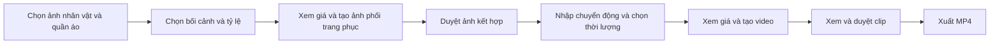

**Kế hoạch triển khai video ngắn từ nhân vật và trang phục có sẵn**

Ngày lập: 2026-09-10. Nhánh khảo sát: `vid-short`.

> Đây là **kế hoạch khảo sát gốc**, không phải đặc tả runtime hiện hành. Các giả định Kling, 5–15 giây, tỷ lệ 1:1, trạng thái UI/first-frame và checklist chưa hoàn tất bên dưới phản ánh source tại ngày lập. Từ 2026-09-11, video ngắn mới dùng Fal/Veo 3.1 cho cả `TextOnly`/`CharacterOutfit`, 4/6/8 giây, 9:16/16:9, first frame Approved/current và quote riêng; migration 4.1.9 đã có trong source và bảng quote còn dùng cho `TextOnly`. Tra [nghiệp vụ chuẩn](NGHIEP_VU_HE_THONG_VIDEOMAKER.md), [kiến trúc](KIEN_TRUC_KY_THUAT.md), [triển khai Veo](TRIEN_KHAI_VIDEO_NGAN_VEO.md) và [runbook](VAN_HANH_VA_PHAT_HANH.md) trước khi làm thay đổi mới.

Trạng thái tại lượt lập kế hoạch: đã triển khai source MVP và kiểm thử tự động theo yêu cầu tiếp theo của người dùng; lúc đó chưa áp migration, bật feature hoặc gọi provider có phí. Báo cáo áp migration/bật riêng Development sau đó nằm tại [biên bản triển khai](TRIEN_KHAI_VIDEO_NGAN_NHAN_VAT_TRANG_PHUC.md). Phần dưới giữ tiêu chí của kế hoạch ban đầu, không suy ra trạng thái hiện hành của checkout/database đích.

**Mục tiêu và giả định**

Người dùng chọn ảnh nhân vật và ảnh quần áo, tạo ảnh nhân vật mặc bộ đồ đó, duyệt ảnh rồi tạo một clip chuyển động. Thành phẩm phải được kiểm tra khuôn mặt, trang phục và chuyển động trước khi xuất MP4 ngay trong màn hình Video ngắn.

Kế hoạch lấy **hai ảnh riêng** làm đầu vào bản đầu. Người dùng chưa xác nhận định dạng ảnh thực tế. Nếu chỉ có một ảnh nhân vật đã mặc đồ, có thể dùng ảnh đó làm ảnh đầu vào đã chuẩn hóa và duyệt, bỏ lượt AI phối trang phục; nhánh này cần được xác định trước T04.

Phạm vi bản đầu: một nhân vật, một bộ trang phục, một cảnh; thời lượng 5–15 giây trong phạm vi model được cấu hình; tỷ lệ 9:16, 16:9 và 1:1 khi model hỗ trợ. Giữ tùy chọn âm thanh môi trường hoặc tắt audio. Lời thoại/TTS, nhiều nhân vật, nhiều bộ đồ trong cùng clip, huấn luyện nhân vật và thư viện trang phục dùng chung chưa thuộc phạm vi này.

Chế độ mới bổ sung vào Video ngắn; project `DirectShortVideo` mô tả chữ hiện có tiếp tục đọc và sử dụng theo hành vi tương thích. Bản đầu nhập ảnh từ máy. Tái sử dụng thư viện nhân vật xuyên project là bước mở rộng sau, phải có ownership và snapshot riêng.

**Luồng người dùng đề xuất**



Ảnh kết hợp giúp người dùng sửa mặt, trang phục hoặc bố cục trước khi trả phí tạo video. Đây là bước kiểm soát chất lượng; không xem việc có ảnh tham chiếu là bảo đảm khuôn mặt, họa tiết hoặc logo sẽ được giữ chính xác trong mọi khung hình.

Mỗi lần tạo lại ảnh hoặc video là thao tác có phí riêng và cần xác nhận giá mới. Chọn ảnh, xem lại, duyệt, tải lại output đã có và xuất lại thành phẩm không tự phát sinh request AI mới.

**Cơ sở kỹ thuật đã kiểm tra**

- [ProjectService.cs](TOOL-LOCAL/Projects/ProjectService.cs): video ngắn hiện lưu một scene, `DirectShortVideo`, `speechMode=None`, không có nhân vật tham chiếu.
- [OpenAiImageClient.cs](TOOL-SERVER/Generation/OpenAiImageClient.cs): đã có edit ảnh, nhưng method hiện nhận một ảnh nguồn. Model trong adapter là `gpt-image-2`.
- [KlingVideoClient.cs](TOOL-SERVER/Generation/KlingVideoClient.cs): đã có đường ảnh sang video; model thường dùng `first_frame`, nhánh tên model chứa `omni` dùng `refer_image`. Không được mặc định hai kiểu này có cùng ý nghĩa.
- [SceneFirstFrameService.cs](TOOL-SERVER/Generation/SceneFirstFrameService.cs): first-frame hiện chuyên cho Fal/Veo video dài, chỉ có tỷ lệ dọc/ngang. Không bỏ điều kiện bảo vệ này để gắn tạm chức năng video ngắn.
- [projectCreation.ts](TOOL-LOCAL/Web/src/features/projects/projectCreation.ts) và [GenerationService.cs](TOOL-SERVER/Generation/GenerationService.cs): UI video ngắn hiện ép thông tin Kling, còn submit dùng project snapshot/policy `Default`; cần đồng bộ trước khi thêm request mới.
- [App.tsx](TOOL-LOCAL/Web/src/App.tsx): trang Video ngắn chưa nối nút duyệt và xuất MP4. Clip có audio tải xong chờ duyệt; clip tắt audio đang được tự duyệt trong luồng cũ.

OpenAI Image Edits hỗ trợ nhiều ảnh đầu vào và có `gpt-image-2` trong model được hỗ trợ. Vì vậy, có cơ sở để mở rộng adapter hiện có nhằm nhận ảnh nhân vật và trang phục có vai trò rõ ràng. Quyền truy cập model và chất lượng trên ảnh người dùng vẫn cần smoke riêng. Nguồn đã đọc: [Image Edits API](https://developers.openai.com/api/reference/resources/images/methods/edit), [GPT Image 2](https://developers.openai.com/api/docs/models/gpt-image-2).

**Các quyết định thiết kế đề xuất**

- Giữ `Script.StructureType=DirectShortVideo`; thêm mode rõ ràng `TextOnly` / `CharacterOutfit`, mặc định dữ liệu cũ là `TextOnly`.
- Tạo nghiệp vụ ảnh kết hợp riêng, dự kiến `ShortVideoComposition`. Không dùng ảnh phối đồ như `CharacterReferenceId` giả hoặc first-frame Fal.
- Ảnh nguồn lưu bản sao local có hash; metadata tham chiếu có project/organization/owner và vai trò nhân vật/trang phục. Server sở hữu xác nhận input, request, chi phí và approval của ảnh kết hợp qua API; không mở rộng quyền SQL desktop sang dữ liệu AI/credential.
- Ảnh kết hợp lưu source image IDs/hash, phiên bản thiết lập, prompt template, tỷ lệ, model ảnh, provider request, output hash, version và bằng chứng duyệt. Request video phải tham chiếu đúng composition đã duyệt và snapshot của nó.
- Thêm method edit nhiều ảnh cho nghiệp vụ này; bảo toàn contract/hành vi một ảnh của video dài. Dùng model ảnh hiện có khi đủ capability/rate/credential; không tự thay model hoặc seed giá.
- Provider video bản đầu là Kling với capability ảnh phù hợp. Readiness, quote, snapshot và submit phải cùng provider/model/resolution/audio/input type. Policy không tương thích trả lý do trước outbound, không tự đổi sang provider khác.
- Ảnh nguồn chỉ được gửi từ native qua HTTPS lên server cho thao tác xử lý đã được người dùng chủ động yêu cầu; server chuyển ảnh đến provider. UI nêu ngắn gọn việc xử lý ảnh Cloud. React không nhận provider key, URL gốc hay absolute path.
- Chế độ `CharacterOutfit` bắt buộc duyệt hình ảnh của clip, kể cả khi tắt audio. Không kế thừa việc tự duyệt clip im lặng của mode cũ.

**Danh sách task và tiêu chí hoàn thành**

| Task | Công việc | Phụ thuộc | Kết quả cần bàn giao |
|---|---|---|---|
| T01 | Chốt thiết kế và capability | Không | Ma trận input/model/tỷ lệ/thời lượng, sơ đồ dữ liệu và đường gọi |
| T02 | DTO, mode, state và WebView contract | T01 | Contracts public đồng bộ C#/TypeScript, quy tắc tương thích |
| T03 | Schema và snapshot | T02 | Migration mới, EF mapping, ownership/index/constraint |
| T04 | Nhập và quản lý hai ảnh nguồn | T02–T03 | Chọn ảnh native, preview, validation, lưu/phục hồi |
| T05 | Quote và tạo ảnh phối trang phục | T01–T04 | Server edit hai ảnh, budget/request/output lifecycle |
| T06 | Duyệt ảnh và kiểm tra phiên bản | T05 | Approval có kiểm tra hash, version và thay đổi đầu vào |
| T07 | Readiness/báo giá/submit video thống nhất | T01–T03 | UI và outbound sử dụng cùng snapshot Kling |
| T08 | Tạo clip từ composition đã duyệt | T06–T07 | Đường ảnh sang video, polling, download và retry |
| T09 | Giao diện và điều phối đầy đủ | T04–T08 | Luồng hai bước duyệt, busy/error/context chính xác |
| T10 | Duyệt clip và xuất MP4 | T08–T09 | Hoàn thành ngay tại Video ngắn, kiểm lineage thành phẩm |
| T11 | Kiểm thử và sửa hồi quy | Theo từng task | Bằng chứng tự động, integration, báo riêng Passed/Failed/Skipped |
| T12 | Nghiệm thu ảnh/video thật và rollout | T01–T11 | Biên bản chất lượng, migration rehearsal, cấu hình và rollback |

- [ ] **T01 — Chốt thiết kế và capability.** Đối chiếu tài liệu provider chính thức với model/endpoint đang được tổ chức cấu hình; xác minh Image Edits hai ảnh và cách Kling nhận ảnh đã phối. Chốt mode mới dùng first-frame hay reference có kiểm soát; không chọn chỉ dựa vào chuỗi `omni`. Lập contract test bằng fake HTTP, ghi rõ điều gì vẫn cần smoke có phí. Chốt hỗ trợ đủ tỷ lệ, thời lượng và audio trước thiết kế UI. Hoàn thành khi có bản đồ request từ hai ảnh đến clip, danh sách capability bị chặn và quy tắc quote/snapshot được thống nhất.

- [ ] **T02 — Contract và state.** Sửa `TOOL-SHARED.Contracts` trước, rồi cập nhật server, desktop, `types.ts`, `WebMessageContracts.cs`, handler và test. Bổ sung DTO ảnh nguồn, quote ảnh, tạo composition, approve/reject, quote video và composition input; field mới tương thích record cũ. Phân biệt đang xử lý ảnh, chờ duyệt ảnh, đang tạo video, chờ duyệt video, stale, lỗi và trạng thái upstream chưa xác định. Mọi mutation mang organization/project, expected revision, request ID hoặc operation ID thích hợp. Hoàn thành khi serialize/validate đúng, dữ liệu cũ không bị chuyển mode ngầm.

- [ ] **T03 — Dữ liệu và migration.** Tạo migration SQL idempotent mới; tên dự kiến `VideoFactory.4.1.9.ShortVideoCharacterOutfit.sql`, kiểm tra lại số version tại thời điểm triển khai. Dự kiến lưu liên kết ảnh nguồn theo vai trò và bảng composition với FK tới project/scene/media/request; thêm liên kết composition vào input request video. Lưu version/hash/approval/reviewer/row version và lịch sử các lần thử. Không lưu Base64 ảnh vào request JSON hoặc ledger. EF server/local và least-privilege phải khớp ownership. Hoàn thành khi chạy lặp trên clone không làm thay đổi project cũ, FK/unique/constraint đúng và desktop không được đọc bảng AI/secret.

- [ ] **T04 — Nhập ảnh nhân vật và trang phục.** Native mở hộp chọn file, tạo bản sao vào workspace; React chỉ nhận ID và virtual preview URL. Bản đầu nhận PNG/JPEG; giới hạn đề xuất 10 MiB/ảnh, tối đa 16 megapixel sau giải mã. Kiểm signature, MIME, số pixel, file lỗi, orientation EXIF và SHA-256; giữ source gốc, tạo bản chuẩn hóa riêng nếu cần. Chọn/đổi ảnh không tự gọi AI. Server đăng ký metadata input thuộc đúng project; khi gửi byte phải kiểm lại ID/hash/role và ownership. Nội dung ảnh tạm trên server phải có hạn lưu, hạn dung lượng và cơ chế dọn; không giữ ảnh vô thời hạn. Hoàn thành khi mở lại project vẫn thấy đúng hai ảnh và ảnh bị đổi trên disk không được dùng âm thầm.

- [ ] **T05 — Tạo ảnh phối trang phục.** Bổ sung service riêng trong server và method edit nhiều ảnh dùng adapter OpenAI hiện có. Prompt phân vai rõ: ảnh thứ nhất cung cấp nhận diện/vóc dáng, ảnh thứ hai cung cấp trang phục; cảnh/bố cục lấy từ thiết lập. Dự kiến tạo ảnh 720×1280, 1280×720 hoặc 1024×1024 tùy tỷ lệ và capability đã xác minh. Xây quote có tính input của cả hai ảnh, quality/size và output; không dùng lại estimate một ảnh như thể không có chi phí input bổ sung. Request qua access, credential, rate, reservation trước outbound; lưu operation bền vững và quyết toán usage/rate snapshot. Timeout chưa biết kết quả phải hiện trạng thái cần đối soát, không tự gửi lượt mới. Download/cache lỗi dùng lại request cũ. Hoàn thành khi tạo được một output kiểm tra hợp lệ, giữ trạng thái chờ duyệt và replay không tính phí hai lần.

- [ ] **T06 — Duyệt ảnh và invalidation.** Hiển thị ảnh nguồn cạnh ảnh kết hợp; có Duyệt ảnh, Tạo lại và Đổi ảnh nguồn. Approval xác minh output hash cùng source revision, tỷ lệ, bố cục và template snapshot bằng kiểm tra cạnh tranh. Đổi nhân vật, trang phục, tỷ lệ hoặc thiết lập hình ảnh làm composition và video phụ thuộc không còn hiện hành; đổi riêng chuyển động/thời lượng làm video cũ hết hiệu lực nhưng có thể giữ ảnh hợp lệ. Request đang chạy giữ snapshot cũ, output được lưu vào lịch sử và không tự chọn làm kết quả mới. Hoàn thành khi stale approval và phản hồi đến muộn đều bị chặn, lịch sử/chi phí không bị xóa.

- [ ] **T07 — Thống nhất policy và báo giá video.** Thay readiness ép Kling ở frontend bằng response server theo mode/project. Quote chứa model, resolution, audio, thời lượng, input composition/revision, giá và thời hạn hiệu lực; submit phải kiểm quote còn khớp và được xác nhận. Với project chưa có snapshot, server chọn model qua policy thích hợp và xác minh Kling/capability trước quote; không đổi policy chung của tổ chức từ desktop. Với project cũ, giữ snapshot và báo rõ khi không tương thích. Hoàn thành khi UI không xác nhận Kling nhưng gửi BytePlus, hoặc báo giá model A rồi submit model B; thiếu rate/budget/credential/policy dừng trước outbound.

- [ ] **T08 — Clip từ ảnh đã duyệt.** Mở rộng `SubmitVideoRequest`, `GenerationService`, `VideoProviderClient` và `KlingVideoClient` để nhận input composition theo kiểu dữ liệu riêng. Server xác minh đúng mode, scene, approved/current, hash, tỷ lệ, quote và request snapshot. Ảnh gửi provider phải đúng bản đã duyệt; không crop/đổi ảnh âm thầm sau duyệt và không fallback Text-to-Video khi thiếu ảnh. Input không được gắn giả vào CharacterReference của luồng khác. Dùng worker polling/output proxy hiện hành; native tải `.part`, kiểm MIME/signature/size/hash/media rồi promote. Retry tải/kiểm/ghép local giữ request provider; Tạo lại clip là operation có phí mới. Hoàn thành khi đóng/mở desktop tiếp tục được task đã gửi và output stale không tự được duyệt.

- [ ] **T09 — Giao diện Video ngắn.** Tách component khỏi `App.tsx` khi triển khai phần mới: mode, hai ô ảnh, bối cảnh, ảnh kết hợp, chuyển động, tỷ lệ/thời lượng/audio, giá và kết quả. Có ba vùng dễ hiểu: Chuẩn bị ảnh → Tạo video → Duyệt và xuất. Nút tạo video chỉ mở sau composition hợp lệ; đổi input yêu cầu xử lý draft và invalidation rõ ràng. Lưu draft/operation trước gửi, khôi phục khi mở lại; khóa bấm lặp, bỏ response khác project/organization và giải phóng busy ở thành công/lỗi/hủy. Không báo hoàn tất chỉ vì có preview. Hoàn thành khi có thể làm toàn bộ thao tác trên trang Video ngắn, kể cả sửa đầu vào và thử lại đúng bước.

- [ ] **T10 — Duyệt clip và xuất MP4.** Bổ sung kiểm tra khuôn mặt, trang phục và chuyển động; khi giữ audio thêm xác nhận đã nghe. Mode mới phải duyệt cả clip im lặng, không đi qua nhánh auto-approve cũ. Kết nối `ProjectRenderService` với đúng approved composition/video generation; kiểm lại hash và version trước/sau render và trước export. Nút Xuất MP4 dùng thành phẩm hiện hành nếu đã có; nếu cần chuẩn hóa/render một cảnh thì thực hiện local trong cùng luồng, không phát request AI. Ghi file tạm rồi promote sau FFprobe/hash, không ghi đè nguồn. Hoàn thành khi tải được MP4 ra nơi chọn ngay tại trang và xuất lại không phát sinh phí.

- [ ] **T11 — Kiểm thử xuyên luồng.** Viết regression cùng task thay vì đợi cuối: DTO/bridge; ảnh giả dạng, quá lớn, đổi hash; cross-user/cross-org/Viewer; thiếu rate/budget; idempotency/retry/Unknown; stale approval; quote khác model; restart/poll/cache; trạng thái audio; render/export sai lineage. Kiểm HTTP body thực sự dùng hai ảnh cho composition và đúng một approved input cho clip. Chạy integration FFmpeg và fixture UI/WebView2 phù hợp. Hồi quy bắt buộc: video ngắn text-only và Fal/Veo first-frame video dài giữ đúng contract/capability. Hoàn thành khi các lệnh chuẩn bên dưới đạt; test opt-in chưa chạy được báo Skipped và không được tính là chất lượng model đã đạt.

- [ ] **T12 — Nghiệm thu và rollout.** Cập nhật nghiệp vụ, kiến trúc, runbook và trạng thái thực tế. Feature `ShortVideoCharacterOutfitEnabled` đề xuất mặc định tắt, server và desktop cùng phiên bản. Rehearsal migration trên clone có backup/restore đã thử. Smoke có phí chỉ sau khi người dùng chỉ rõ môi trường, ảnh mẫu và ngân sách; cấu hình rate do admin quản lý, không lấy giá website để seed. Tắt feature chặn thao tác mới nhưng worker vẫn hoàn tất/đối soát task đã gửi. Không rollback xuống binary không hiểu mode/lineage mới để render project mới. Hoàn thành khi có bằng chứng trên đúng môi trường và người dùng duyệt chất lượng ảnh/video, không chỉ có build xanh.

**Thứ tự thực hiện và mốc kiểm tra**

Thứ tự đề xuất: T01 → T02 → T03 → T04 → T05 → T06 → T07 → T08 → T09 → T10 → T11 → T12. T11 được thực hiện dần theo từng task; lần chạy toàn bộ là mốc cuối. Đây là thứ tự công việc, không phải yêu cầu chạy nhiều agent.

Mốc A, sau T06: chọn được hai ảnh, tạo và duyệt ảnh phối đồ; chưa bật tạo clip của mode mới.

Mốc B, sau T10: hoàn thành luồng ảnh → video → duyệt → MP4, giữ đúng snapshot và phục hồi task.

Mốc C, sau T11–T12: test, migration rehearsal và nghiệm thu provider thật đạt; mới mở feature theo tổ chức/môi trường.

**Bộ mẫu và tiêu chí nghiệm thu chất lượng**

Chuẩn bị ít nhất 6 bộ ảnh đại diện: nhân vật nam/nữ, ảnh chân dung/toàn thân, trang phục phẳng/ma-nơ-canh, đồ trơn/họa tiết, váy/bộ áo-quần. Clip cần có chuyển động nhẹ, bước đi và xoay người; kiểm mẫu ở cả tỷ lệ dọc/ngang/vuông được hỗ trợ. Dùng ảnh người dùng được phép xử lý.

Mỗi mẫu được ghi nhận riêng: giống khuôn mặt, đúng màu/kiểu dáng trang phục, giữ chi tiết quan trọng, không còn chồng bộ đồ cũ, tay/cơ thể hợp lý, trang phục ổn định trong chuyển động, audio đúng lựa chọn và MP4 phát được. Lưu số lần thử và chi phí thực tế; người dùng chọn tiêu chí nào bắt buộc đối với sản phẩm của mình trước khi mở feature rộng.

Không xác nhận độ chính xác kích cỡ mặc thật hoặc chi tiết mặt sau chỉ từ ảnh mặt trước. Các kết quả chưa đạt phải cho phép quay lại đúng bước tạo ảnh hoặc tạo clip, không tự chạy thêm lượt có phí.

**Lệnh kiểm tra khi đã triển khai source**

```powershell
dotnet restore TOOL_GEN_POST_VIDEO.slnx
dotnet build TOOL_GEN_POST_VIDEO.slnx -c Release --no-restore
dotnet test TOOL-TESTS\TOOL-TESTS.csproj -c Release --no-build
```

```powershell
Set-Location TOOL-LOCAL\Web
npm ci --no-audit --no-fund
npm run build
npm test
```

Các lệnh trên thuộc kế hoạch tương lai và chưa được chạy trong phiên lập tài liệu. Báo riêng Passed/Failed/Skipped, giới hạn fixture, ảnh/video thật và môi trường nghiệm thu. Việc đồng ý kế hoạch chưa thay thế chỉ định môi trường/chi phí cho migration thật, provider smoke hoặc phát hành.
